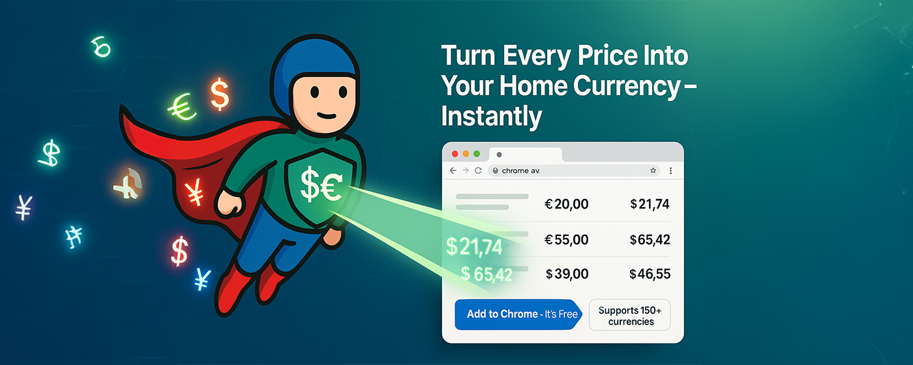

# CurrencyMan Chrome Extension

CurrencyMan is a Chrome extension that allows you to convert currency values on webpages to your preferred local currency. Simply select any text containing a currency value, and a popup will show the converted amount.

## Features


- Convert currencies by selecting text on any webpage
- Supports multiple currency formats (symbols and codes)
- Uses real-time exchange rates for accurate conversions
- Customizable target currency setting
- Caches exchange rates to minimize API calls
- Works with various currency formats and notations

## Project Structure

The project is organized into the following directories:

- **src/**: Source code for the extension
  - **background/**: Background script
  - **content/**: Content script
  - **popup/**: Popup UI
  - **styles/**: CSS styles
- **assets/**: Images and icons
  - **icons/**: Extension icons
  - **images/**: Promotional images
- **docs/**: Documentation
- **test/**: Test files
  - **unit/**: Unit tests
  - **manual/**: Manual test pages
- **tools/**: Utility tools

Each directory contains a README.md file with more information.

## Installation

### From Source Code

1. Clone or download this repository
2. Install dependencies: `npm install`
3. Build the extension: `npm run build`
4. Open Chrome and navigate to `chrome://extensions/`
5. Enable "Developer mode" by toggling the switch in the top right corner
6. Click "Load unpacked" and select the `dist` directory created by the build process
7. The extension should now be installed and active

## Development

### Building the Extension

```
npm run build
```

### Running Tests

```
npm test
```

### Watch Mode (for development)

```
npm run watch
```

## Usage

1. Browse any webpage with currency values
2. Select any text containing a currency value (e.g., "$10.50", "EUR 100", "10 GBP")
3. A popup will appear showing the converted value in your preferred currency
4. Click the extension icon in the toolbar to open the settings panel
5. In the settings panel, you can:
   - Change your target currency
   - Save your preferences

## Testing

Manual test pages are included to verify the extension's functionality:

1. Build and install the extension
2. Open `test/manual/test-page.html` in Chrome
3. The page contains various currency formats to test the conversion feature
4. Select any currency value on the page to see the conversion

## API Information

This extension uses the free currency conversion API from:
`https://cdn.jsdelivr.net/npm/@fawazahmed0/currency-api@latest/v1/currencies/{currency}.json`

The API provides real-time exchange rates for various currencies.

## Troubleshooting

If currency conversion is not working:

1. Make sure the extension is enabled in Chrome
2. Check if you have an active internet connection for API access
3. Try selecting a different currency value
4. Make sure you're selecting text that contains a valid currency format
5. Clear the extension's cache by uninstalling and reinstalling it

## License

This project is open source and available for personal and commercial use.
